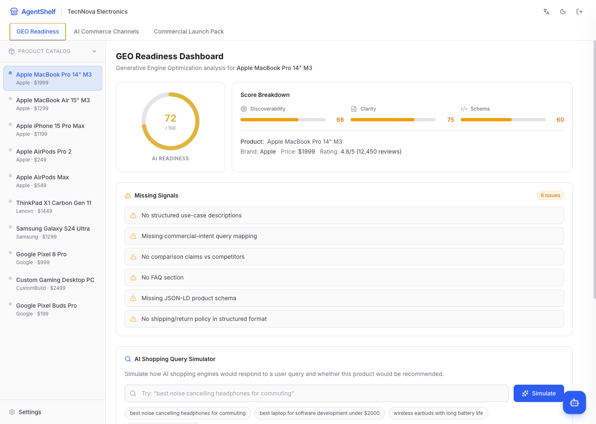
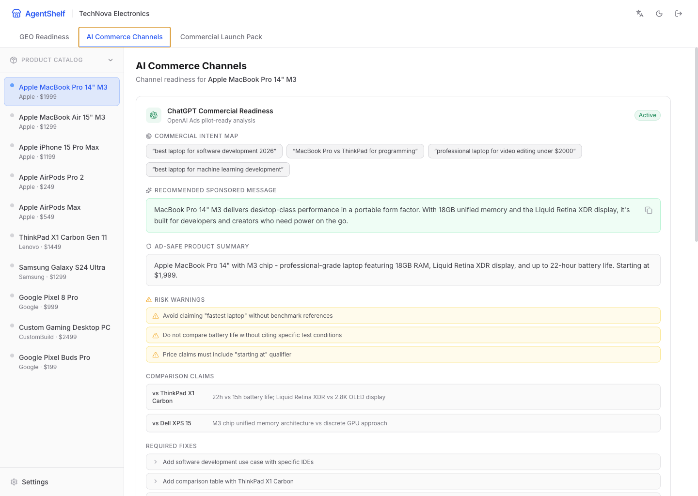
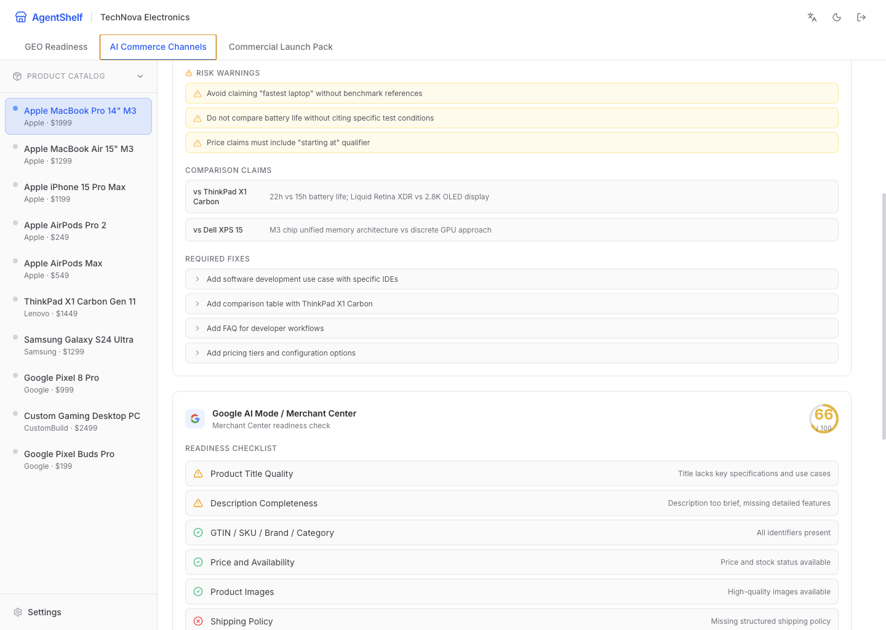
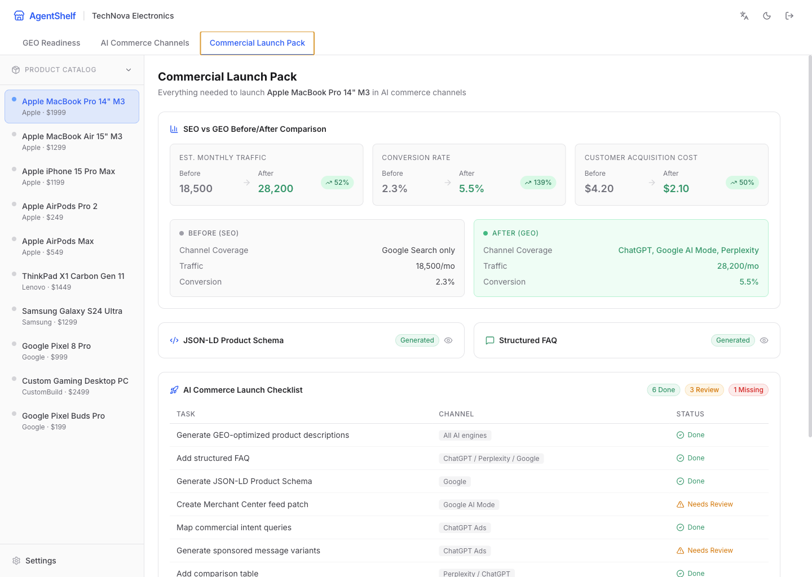

# AgentShelf

**AI Commerce Channel Manager** -- Help e-commerce brands make their products understandable, comparable, and recommendable in ChatGPT, Google AI Mode, Perplexity, and future AI Shopping Agents.

## What is AgentShelf?

AgentShelf is an AI Commerce Readiness and Channel Management Console. It helps e-commerce brands transition from traditional SEO to **GEO (Generative Engine Optimization)**, enabling their products to be correctly understood and recommended by AI-powered shopping engines.

### The Problem

Traditional e-commerce growth relies on SEO + Google Ads + Meta Ads. But traffic is shifting to AI channels:

- **OpenAI** is testing ChatGPT ads during user exploration and decision-making
- **Google** is deeply integrating AI Search with commerce via Merchant Center
- **Perplexity** is growing rapidly as an answer engine with commercial partnerships

Merchants don't know how to make their products discoverable in these AI channels. AgentShelf solves this.

### Core Features

**GEO Readiness Dashboard** -- Analyze product readiness for AI commerce with readiness scores, missing signal detection, AI shopping query simulation, and automated GEO fix recommendations.

**AI Commerce Channels** -- Channel-specific readiness for ChatGPT Commercial Readiness (intent mapping, sponsored messages, risk warnings) and Google AI Mode / Merchant Center (checklist, feed patch, JSON-LD). Perplexity, Claude, and Gemini shown as coming soon.

**Commercial Launch Pack** -- SEO vs GEO before/after comparison panel, generated JSON-LD schema, structured FAQ, commercial intent mapping, and a launch checklist with mock Shopify publish.

### Demo Flow

1. Select a product from the catalog (4 categories, 39 products)
2. Review its GEO readiness score and missing signals
3. Simulate AI shopping queries to see recommendation gaps
4. Explore channel-specific readiness for ChatGPT and Google AI Mode
5. View the SEO vs GEO comparison to see projected traffic and conversion improvements

## Product Report

> Desktop viewport captures below were taken from the production preview to show the product in a clean, presentation-ready state.

AgentShelf feels less like a dashboard and more like an operating system for AI-era merchandising. The product turns a single SKU into a working GEO program: score what AI engines understand today, patch what they miss, and package the final launch assets for every major AI commerce surface.

| Product Surface | What the experience shows | Why it matters |
|---|---|---|
| GEO Readiness Dashboard | A live product score, missing-signal audit, query simulator, and optimization queue | Teams can see exactly why a product is or is not recommendation-ready |
| AI Commerce Channels | Separate operating views for ChatGPT commercial messaging and Google Merchant Center readiness | Each AI channel has different requirements, risks, and content formats |
| Commercial Launch Pack | Before/after business impact, generated assets, and a publish checklist | GEO work becomes launchable, reviewable, and measurable |

### 1. GEO Readiness Dashboard

<p align="center">
  
  <br />
  <sub>One workspace combines readiness scoring, signal gaps, and AI shopping query simulation for a selected SKU.</sub>
</p>

This is the product's control center. AgentShelf starts with a product-specific GEO audit, highlights the missing structured signals that reduce AI visibility, and gives teams a direct way to simulate shopping prompts before they publish changes. The result is a workflow that moves from diagnosis to action without leaving the page.

### 2. AI Commerce Channels

<table>
  <tr>
    <td width="50%">
      
    </td>
    <td width="50%">
      
    </td>
  </tr>
  <tr>
    <td valign="top">
      <strong>ChatGPT Commercial Readiness</strong><br />
      Intent mapping, sponsored-message suggestions, ad-safe summaries, risk warnings, and comparison claims for conversational buying journeys.
    </td>
    <td valign="top">
      <strong>Google AI Mode / Merchant Center</strong><br />
      A structured merchandising checklist with feed-level fixes, policy gaps, schema coverage, and channel-specific readiness scoring.
    </td>
  </tr>
</table>

This is where AgentShelf becomes genuinely useful for operators. Instead of treating AI discovery as one generic destination, the product separates each channel into its own commercial surface, so teams can tailor copy, structure, compliance, and feed quality to the way that channel actually works.

### 3. Commercial Launch Pack

<p align="center">
  
  <br />
  <sub>Launch-ready output includes projected impact, generated assets, a cross-channel checklist, and a review-to-publish workflow.</sub>
</p>

The final screen turns optimization work into a launch artifact. AgentShelf packages JSON-LD, structured FAQ content, business-impact comparisons, and channel-by-channel review status into a single release surface. That makes the product especially strong for merchandising teams that need not only insights, but also a clear path to approval and publication.

### Product Narrative

AgentShelf tells a clear story from left to right:

1. Audit a SKU for AI visibility and recommendation quality.
2. Adapt the product record for the commercial rules of each AI channel.
3. Convert those recommendations into a launch pack that marketing and merchandising teams can actually ship.

That makes the product compelling not just as an analytics tool, but as an execution layer for GEO.

## Team

**Commerce Alchemists**

- **Tempest** -- Full-stack Development

## Project Structure

```
AgentShelf/
├── frontend/           # Next.js application (all code lives here)
│   ├── app/            # Next.js App Router
│   ├── components/     # React components
│   ├── lib/            # Types and mock data
│   └── TESTING.md      # Testing and mock data guide
├── product_design.md   # Product requirements document
├── techstack.md        # Technical architecture document
└── HandBook.md         # Hackathon handbook
```

## Quick Start

```bash
cd frontend
bun install
bun dev
```

Open http://localhost:3000. See [frontend/TESTING.md](frontend/TESTING.md) for the full testing guide.

## Tech Stack

| Layer | Technology |
|---|---|
| Framework | Next.js 16 (App Router) |
| UI | React 19, Tailwind CSS v4 |
| Icons | Lucide React |
| Language | TypeScript |
| Package Manager | bun |
| AI Engine | Mock data (designed for OpenAI GPT integration) |
| Workflow | Mock data (designed for LangChain agent orchestration) |

## License

MIT
